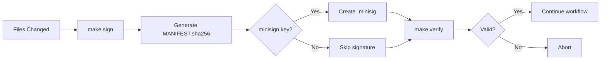

# Artifacts Directory - Signed Manifests and Build Outputs

**Purpose:** Cryptographically verifiable build artifacts, manifests, and signatures.

## Contents

### MANIFEST.sha256

**Format:** Plain text, one line per file  
**Generation:** Automated via `make sign`  
**Signature:** MANIFEST.sha256.minisig (if minisign key present)

**Format:**
```
<sha256-hash> <relative-path>
```

**Example:**
```
abc123def456...  unified_tools/sbom_gen.py
def789ghi012...  core/src/main.rs
```

## Security Features

### 1. Cryptographic Signing

**minisign Integration:**
```bash
# Generate signing key (one-time)
minisign -G -p unified_orchestration/keys/minisign.pub \
            -s unified_orchestration/keys/minisign.key

# Sign manifest (automatic with make sign)
export FLEX_MINISIGN_PUB=unified_orchestration/keys/minisign.pub
make sign
```

### 2. fs-verity Support

**Kernel-Level Integrity:**
```bash
# Enable fs-verity on manifest
sudo make fs-verity-enable

# Enforce at runtime
export FLEX_ENFORCE_SEAL=1
```

### 3. Read-Only Mount

**Immutability Enforcement:**
```bash
# Mount artifacts directory read-only
sudo mount -o remount,ro /path/to/artifacts

# Enforce in runtime
export FLEX_ENFORCE_MOUNT_RO=1
```

## Usage

### Generate Manifest

```bash
make sign
```

This creates:
- `artifacts/MANIFEST.sha256` - Hash manifest
- `artifacts/MANIFEST.sha256.minisig` - Signature (if key available)

### Verify Artifacts

```bash
make verify
```

Verification checks:
- ✅ All files match manifest hashes
- ✅ Signature is valid (if present)
- ✅ fs-verity measurements (if enabled)
- ✅ Read-only mount (if enforced)

### Manual Verification

```bash
# Verify single file
sha256sum unified_tools/sbom_gen.py
grep "sbom_gen.py" artifacts/MANIFEST.sha256

# Verify signature
minisign -Vm artifacts/MANIFEST.sha256 \
         -p unified_orchestration/keys/minisign.pub
```

## Integration Points

### With SBOM

Manifest includes SBOM file hash:
```bash
grep "sbom.cdx.json" artifacts/MANIFEST.sha256
```

### With Anchoring

Manifest is included in Merkle tree:
```bash
make anchor  # Includes MANIFEST.sha256
```

### With Runtime

Core service enforces manifest verification:
```bash
export FLEX_MINISIGN_PUB=/path/to/pub
export FLEX_ENFORCE_SEAL=1
make run-core  # Fails if verification fails
```

## Environment Variables

- `FLEX_MINISIGN_PUB` - Path to minisign public key (enables signature verification)
- `FLEX_ENFORCE_SEAL` - Require immutable/fs-verity on manifest (0|1)
- `FLEX_ENFORCE_MOUNT_RO` - Require read-only mount for artifacts/ (0|1)

## File Lifecycle



## Best Practices

### 1. Key Management

- **Keep private keys secure:** Never commit minisign.key to Git
- **Backup keys:** Store encrypted backups offline
- **Rotate regularly:** Generate new keys annually

### 2. Manifest Updates

- **Regenerate after changes:** Always run `make sign` after file modifications
- **Verify before commit:** Run `make verify` in pre-push hook
- **Track in Git:** Commit MANIFEST.sha256 to version control

### 3. Production Deployment

- **Enable fs-verity:** For kernel-level integrity on production systems
- **Read-only mounts:** Mount artifacts/ read-only in production
- **Signature enforcement:** Always set FLEX_MINISIGN_PUB in production

## Troubleshooting

**Problem:** Signature verification fails
- **Solution:** Check FLEX_MINISIGN_PUB points to correct public key

**Problem:** Hash mismatch on file
- **Solution:** Regenerate manifest with `make sign` after file changes

**Problem:** fs-verity not available
- **Solution:** Requires kernel 5.4+ with CONFIG_FS_VERITY enabled

**Problem:** Cannot write to artifacts/
- **Solution:** Remount read-write temporarily: `sudo mount -o remount,rw artifacts/`

## Security Considerations

### Threat Model

**Protected Against:**
- ✅ Unauthorized file modifications
- ✅ Supply chain tampering
- ✅ Malicious artifact injection
- ✅ Accidental corruption

**Not Protected Against:**
- ❌ Compromised signing key (use HSM for highest security)
- ❌ Kernel-level rootkits (use secure boot + measured boot)
- ❌ Physical access attacks (use full-disk encryption)

### Audit Trail

All verification events are logged:
```bash
# Check verification logs
grep "verify" operational_logs/system.log
```

## Compliance

**Standards:**
- SLSA Level 2+ (with signing)
- NIST SP 800-218 SSDF
- NTIA SBOM Minimum Elements

## Related Tools

- **signer.py** - Manifest and signature generation
- **verify.py** - Verification script
- **merkle_anchor.py** - Anchoring with manifest inclusion
- **verity_policy.py** - fs-verity policy management

## Related Documentation

- [Agent Task Lifecycle SOP](../agentask.sop)
- [Makefile Targets](../Makefile) - See sign, verify targets
- [Security Best Practices](../docs/security/)

---

**Generated:** 2025-01-05 | **Version:** 1.0 | **Status:** Production Ready  
**Last Manifest Update:** Check `artifacts/MANIFEST.sha256` timestamp
