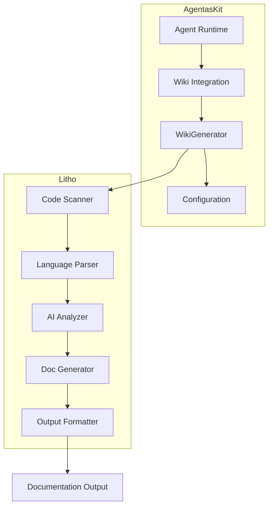

# AgentasKit Wiki Integration (Litho/deepwiki-rs)

This module provides integration with [Litho](https://github.com/sopaco/deepwiki-rs) (also known as deepwiki-rs), an AI-powered documentation generator that automatically creates C4 architecture documentation from source code.

## Features

- **AI-Powered Analysis**: Uses LLMs to understand code structure and relationships
- **C4 Model Documentation**: Generates Context, Container, Component, and Code diagrams
- **Multi-Language Support**: Works with Rust, Python, Java, Go, JavaScript, and more
- **Mermaid Diagrams**: Automatic generation of architectural diagrams
- **Customizable Output**: Configure what documentation to generate

## Architecture



## Quick Start

### 1. Add Dependency

```toml
[dependencies]
agentaskit-wiki-integration = { path = "integrations/wiki-rs" }
```

### 2. Generate Documentation

```rust
use agentaskit_wiki_integration::{
    WikiGeneratorBuilder,
    config::WikiConfig,
};
use std::path::PathBuf;

#[tokio::main]
async fn main() -> Result<(), Box<dyn std::error::Error>> {
    // Create generator with builder
    let mut generator = WikiGeneratorBuilder::new(PathBuf::from("./my-project"))
        .output_dir(PathBuf::from("./docs"))
        .language("en")
        .model_efficient("gpt-4o-mini")
        .model_powerful("gpt-4o")
        .build();

    // Generate documentation
    let result = generator.generate().await?;

    println!("{}", result.summary());
    // Output: Generated 15 documentation files in 45.50s to "./docs"

    Ok(())
}
```

### 3. Using Configuration File

```rust
use agentaskit_wiki_integration::{WikiConfig, WikiGenerator};
use std::path::PathBuf;

#[tokio::main]
async fn main() -> Result<(), Box<dyn std::error::Error>> {
    // Load configuration
    let config = WikiConfig::from_file(&PathBuf::from("./configs/wiki/local.toml"))?;

    // Create generator
    let mut generator = WikiGenerator::new(config);

    // Generate documentation
    let result = generator.generate().await?;
    println!("{}", result.summary());

    Ok(())
}
```

## Configuration

### Local Development (`configs/wiki/local.toml`)

```toml
[project]
path = "."
output_dir = "./litho.docs"
target_language = "en"

[llm]
model_efficient = "gpt-4o-mini"
model_powerful = "gpt-4o"
enable_preset_tools = true

[processing]
skip_preprocessing = false
skip_research = false
enable_cache = true

[output]
generate_overview = true
generate_architecture = true
generate_workflow = true
generate_deep_dive = true
generate_diagrams = true
```

### LLM Providers

The integration supports multiple LLM providers:

```rust
use agentaskit_wiki_integration::llm::providers;

// OpenAI (default)
let openai = providers::openai();

// Anthropic Claude
let anthropic = providers::anthropic();

// Local Ollama
let ollama = providers::ollama();

// Azure OpenAI
let azure = providers::azure("https://my-endpoint.openai.azure.com", "my-deployment");
```

## Output Structure

Generated documentation follows the C4 model structure:

```
litho.docs/
├── 1、项目概述.md          # Project Overview
├── 2、架构概览.md          # Architecture Overview
├── 3、工作流程.md          # Workflow Overview
├── 4、深入探索/            # Deep Dive
│   ├── Module1.md
│   ├── Module2.md
│   └── ...
└── __Litho_Summary__.md    # Summary Report
```

## Working with Output

```rust
use agentaskit_wiki_integration::output::{DocTree, Document};
use std::path::PathBuf;

// Load documentation tree
let tree = DocTree::from_directory(&PathBuf::from("./litho.docs"))?;

// Get all document paths
let paths = tree.all_paths();
println!("Generated {} documents", paths.len());

// Generate table of contents
let toc = tree.generate_toc();
println!("{}", toc);

// Parse a specific document
let doc = Document::from_file(&PathBuf::from("./litho.docs/2、架构概览.md"))?;
println!("Title: {}", doc.title);
println!("Diagrams: {}", doc.diagrams.len());
println!("Code blocks: {}", doc.code_blocks.len());
```

## Modules

| Module | Description |
|--------|-------------|
| `config` | Configuration types for wiki generation |
| `generator` | Wiki documentation generator |
| `llm` | LLM provider configurations |
| `output` | Documentation output handling |

## Building Litho

The wiki-rs (Litho) binary must be built from the submodule:

```bash
cd wiki-rs
cargo build --release
```

The binary will be at `wiki-rs/target/release/deepwiki-rs`.

Alternatively, install from crates.io:

```bash
cargo install deepwiki-rs
```

## Environment Variables

| Variable | Description |
|----------|-------------|
| `OPENAI_API_KEY` | OpenAI API key |
| `ANTHROPIC_API_KEY` | Anthropic API key |
| `LLM_API_BASE_URL` | Custom LLM API base URL |
| `LLM_MODEL_EFFICIENT` | Efficient model name |
| `LLM_MODEL_POWERFUL` | Powerful model name |

## License

MIT OR Apache-2.0
